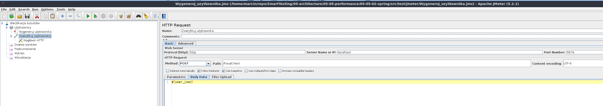
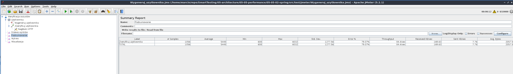

= Testy wydajności

== Uruchomienie testów wydajnościowych za pomocą Apache JMeter

Najpierw uruchamiamy infrastrukturę.

```
$ docker-compose up
```

Następnie budujemy i uruchamiamy aplikację.

```
$ ./05-05-02-spring/mvnw install
$ ./05-05-02-spring/target/05-05-02-spring-0.0.1-SNAPSHOT.jar
```

Instalujemy i uruchamiamy aplikację Apache JMeter - https://jmeter.apache.org/

Importujemy plik z konfiguracją wygenerowania użytkownika `05-05-02-spring/src/test/jmeter/Wygeneruj_uzytkownika.jmx` poprzez kliknięcie w `File->Open`. Testy wydajnościowe ustawione są pod uruchomienie na porcie `9876`.



To co chcemy osiągnąć to wysłanie JSONa w celu wygenerowania użytkownika.


Chcemy przeprowadzić load testy, czyli zobaczyć ilu użytkowników jesteśmy w stanie obsłużyć. Oczywiście na potrzeby szkolenia nie przygotowujemy specjalnego środowiska, uruchamiamy po prostu aplikację lokalnie.

image::05-05-02-spring/src/test/resources/images/jmeter_co_chcemy_osiagnac.png[]

`Ramp-up period` : Czas, który JMeter potrzebuje, żeby uruchomić odpowiednią liczbę wątków. W naszej sytuacji JMeter ma 10 sekund, żeby uruchomić 10 000 wątków. Czyli co sekundę uruchomionych zostanie kolejnych 1 000 wątków.

Ustawiamy konfigurację związaną z połączeniem (max 1 000 ms, na połączenie i 6 000 ms na odpowiedź).

image::05-05-02-spring/src/test/resources/images/jmeter_timeout_config.png[]

Uruchamiamy testy poprzez wciśnięcie zielonego przycisku play na górze.

image::05-05-02-spring/src/test/resources/images/jmeter_uruchomienie.png[]

W pewnym momencie możemy zauważyć, że wyskakują nam błędy.

image::05-05-02-spring/src/test/resources/images/jmeter_moment_krytyczny.png[]

Błędy dotyczą połączenia.

image::05-05-02-spring/src/test/resources/images/jmeter_socket_timeout.png[]

Możemy też pokazać podsumowanie związane z uruchomieniem naszego testu.



== Uruchomienie testów micro-benchmarkingu za pomocą JMH

Dla potrzeb szkolenia uruchomimy test za pomocą IDE. Normalnie, należy zbudować tzw. uber jara, którego uruchomimy z linii poleceń.

W klasie `05-05-02-spring/src/test/java/pl/smarttesting/verifier/model/Benchmarks.java` mamy zdefiniowane testy micro-benchmark.

Żeby je uruchomić odpalamy `RunJmhBenchmarksFromIde.java`.

I dostaniemy mniej więcej taki wynik w konsoli.

```
# Detecting actual CPU count: 8 detected
# JMH version: 1.22
# VM version: JDK 13, OpenJDK 64-Bit Server VM, 13+33
# VM invoker: ...
# VM options: ...
# Warmup: 2 iterations, 10 s each
# Measurement: 2 iterations, 10 s each
# Timeout: 10 min per iteration
# Threads: 8 threads, will synchronize iterations
# Benchmark mode: Sampling time
# Benchmark: pl.smarttesting.verifier.model.Benchmarks.shouldProcessFraud

# Run progress: 0.00% complete, ETA 00:00:40
# Fork: 1 of 1
# Warmup Iteration   1: 576.413 ±(99.9%) 80.729 ms/op
# Warmup Iteration   2: 552.087 ±(99.9%) 78.548 ms/op
Iteration   1: 626.739 ±(99.9%) 85.888 ms/op
                 shouldProcessFraud·p0.00:   100.401 ms/op
                 shouldProcessFraud·p0.50:   609.747 ms/op
                 shouldProcessFraud·p0.90:   1029.177 ms/op
                 shouldProcessFraud·p0.95:   1052.403 ms/op
                 shouldProcessFraud·p0.99:   1093.770 ms/op
                 shouldProcessFraud·p0.999:  1096.810 ms/op
                 shouldProcessFraud·p0.9999: 1096.810 ms/op
                 shouldProcessFraud·p1.00:   1096.810 ms/op

Iteration   2: 642.370 ±(99.9%) 85.703 ms/op
                 shouldProcessFraud·p0.00:   106.299 ms/op
                 shouldProcessFraud·p0.50:   693.109 ms/op
                 shouldProcessFraud·p0.90:   1013.554 ms/op
                 shouldProcessFraud·p0.95:   1066.402 ms/op
                 shouldProcessFraud·p0.99:   1095.972 ms/op
                 shouldProcessFraud·p0.999:  1098.908 ms/op
                 shouldProcessFraud·p0.9999: 1098.908 ms/op
                 shouldProcessFraud·p1.00:   1098.908 ms/op


Result "pl.smarttesting.verifier.model.Benchmarks.shouldProcessFraud":
  N = 255
  mean =    634.524 ±(99.9%) 59.854 ms/op

  Histogram, ms/op:
    [ 100.000,  200.000) = 24
    [ 200.000,  300.000) = 20
    [ 300.000,  400.000) = 18
    [ 400.000,  500.000) = 23
    [ 500.000,  600.000) = 30
    [ 600.000,  700.000) = 27
    [ 700.000,  800.000) = 27
    [ 800.000,  900.000) = 28
    [ 900.000, 1000.000) = 26

  Percentiles, ms/op:
      p(0.0000) =    100.401 ms/op
     p(50.0000) =    652.214 ms/op
     p(90.0000) =   1017.748 ms/op
     p(95.0000) =   1055.077 ms/op
     p(99.0000) =   1092.113 ms/op
     p(99.9000) =   1098.908 ms/op
     p(99.9900) =   1098.908 ms/op
     p(99.9990) =   1098.908 ms/op
     p(99.9999) =   1098.908 ms/op
    p(100.0000) =   1098.908 ms/op


# Run complete. Total time: 00:00:46

REMEMBER: The numbers below are just data. To gain reusable insights, you need to follow up on
why the numbers are the way they are. Use profilers (see -prof, -lprof), design factorial
experiments, perform baseline and negative tests that provide experimental control, make sure
the benchmarking environment is safe on JVM/OS/HW level, ask for reviews from the domain experts.
Do not assume the numbers tell you what you want them to tell.

Benchmark                                                   Mode  Cnt     Score    Error  Units
Benchmarks.shouldProcessFraud                             sample  255   634.524 ± 59.854  ms/op
Benchmarks.shouldProcessFraud:shouldProcessFraud·p0.00    sample        100.401           ms/op
Benchmarks.shouldProcessFraud:shouldProcessFraud·p0.50    sample        652.214           ms/op
Benchmarks.shouldProcessFraud:shouldProcessFraud·p0.90    sample       1017.748           ms/op
Benchmarks.shouldProcessFraud:shouldProcessFraud·p0.95    sample       1055.077           ms/op
Benchmarks.shouldProcessFraud:shouldProcessFraud·p0.99    sample       1092.113           ms/op
Benchmarks.shouldProcessFraud:shouldProcessFraud·p0.999   sample       1098.908           ms/op
Benchmarks.shouldProcessFraud:shouldProcessFraud·p0.9999  sample       1098.908           ms/op
Benchmarks.shouldProcessFraud:shouldProcessFraud·p1.00    sample       1098.908           ms/op

Process finished with exit code 0

```